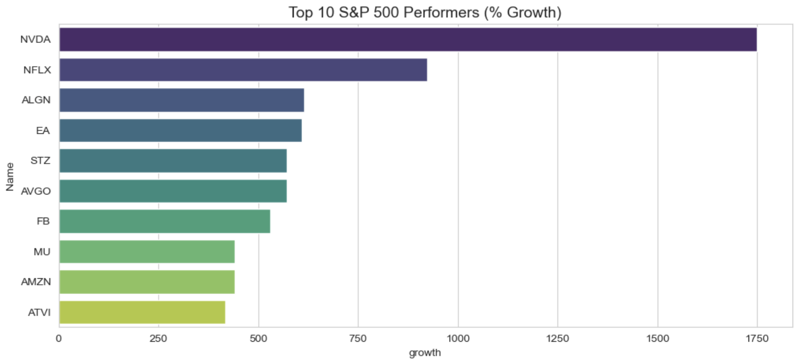
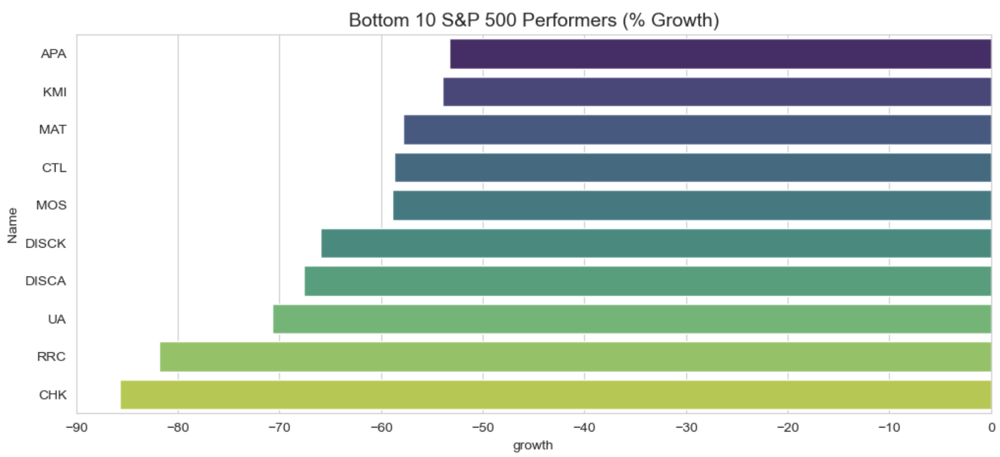
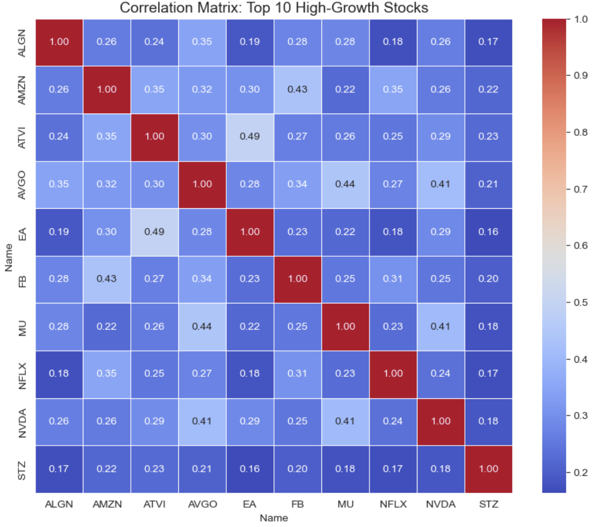

# S&P 500 Market Analysis: Risk, Returns and Sector Insights (2013-2018)

## Project Objective
This project provides a comprehensive data-driven analysis of the S&P 500 performance over a five-year period. By moving beyond simple price tracking, I explored the relationship between volatility and returns, identified market leaders vs laggards, and mapped sector-level trends to extract actionable business intelligence.

## Key Business Insights
- The Risk Paradox: My analysis revealed that the 10 worst-performing stocks actually had higher average volatility (0.0244) than the top 10 winners (0.0212). This proves that in this market cycle, higher risk did not yield higher rewards.

- Growth Divergence: Top performers (Winners) achieved an average daily return of 0.18%, while the bottom performers (Losers) averaged a daily loss of -0.07%, showcasing a massive gap in capital preservation.

- Sector Dominance: Technology and Consumer Discretionary sectors led the market growth, while Energy and specific Retail segments faced significant headwinds due to macroeconomic shifts.

## Dataset
- Source: Kaggle - S&P 500 Historical Stock Data(https://www.kaggle.com/datasets/camnugent/sandp500)  
- Scope: 500+ companies, February 2013 to February 2018.
- Features: Date, Open/High/Low/Close prices, Volume, and Ticker Symbols.

## Technical Workflow
1. Data Engineering: Converted time-series data, handled missing values using forward-fill (ffill) logic, and engineered daily_return and volatility metrics.

2. Exploratory Data Analysis (EDA): Analyzed aggregate market volume to identify "panic" spikes and liquidity trends.

3. Risk-Reward Mapping: Utilized scatter plots to identify the Efficient Frontier - stocks that provide maximum return for minimum risk.

4. Portfolio Correlation: Developed a correlation matrix to identify cluster risks among top-performing assets.

## Visualizations & Findings
- Market Leaders vs. Laggards
The following charts identify the stocks with the highest and lowest cumulative growth over the 5-year period. This highlights the divergence between high-performing sectors (Tech) and struggling industries (Energy/Retail).

- Top 10 Performers (% Growth)** 

- Bottom 10 Performers (% Growth)** 

## Key Visualizations

| Risk vs. Reward | Correlation Heatmap |
| :---: | :---: |
|  |  |

## How to Use
1. Clone the Repo:
git clone https://github.com/jiajian98/s-p-500.git

2. Install Dependencies:
pip install -r requirements.txt

3. Run the Analysis: Open notebooks/s&p500.ipynb in Jupyter or VS Code and run all cells.

## Future Work
- Machine Learning: Implement an LSTM (Long Short-Term Memory) model to forecast short-term price movements.

- NLP Sentiment Analysis: Scrape financial news to correlate market volatility with media sentiment.

- Portfolio Optimization: Use the Markowitz Efficient Frontier model to suggest optimal asset weightings.

